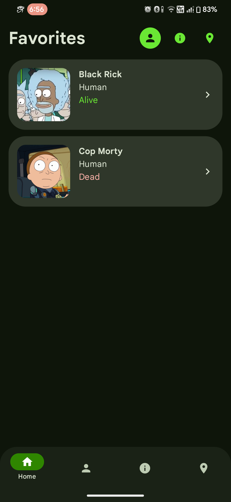
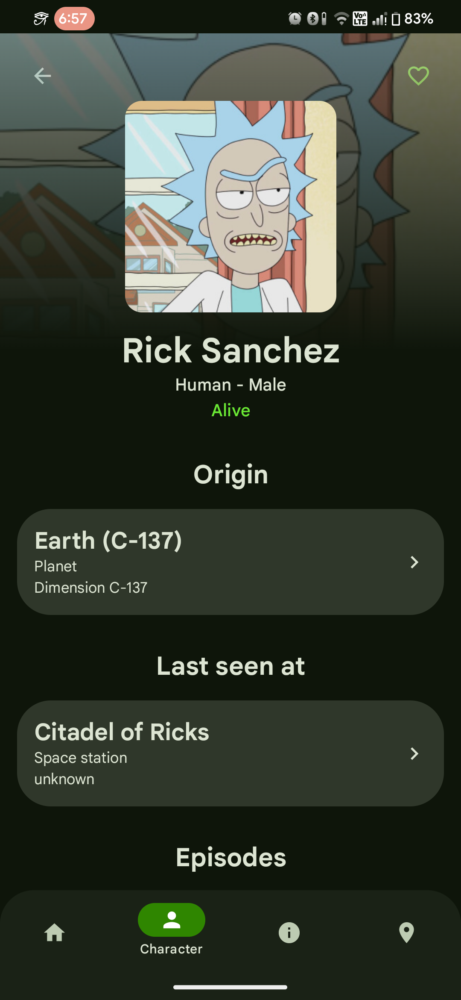
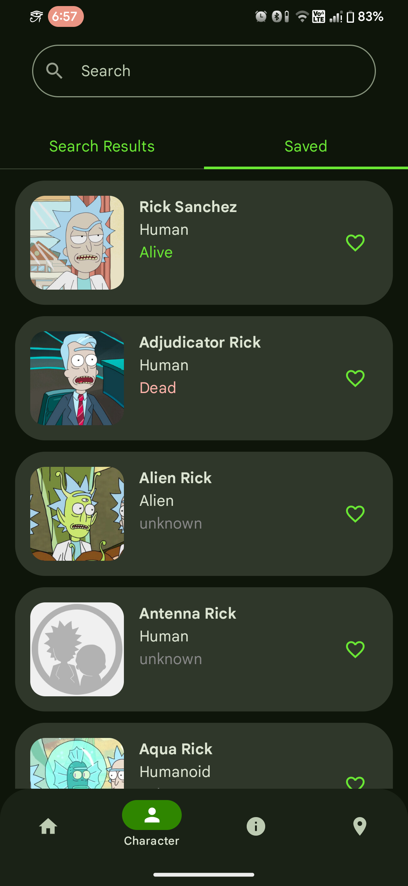
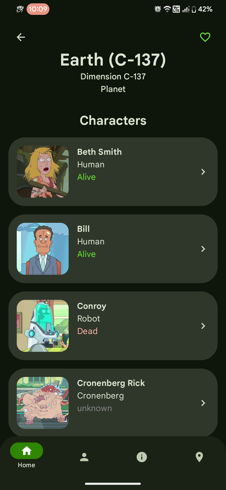
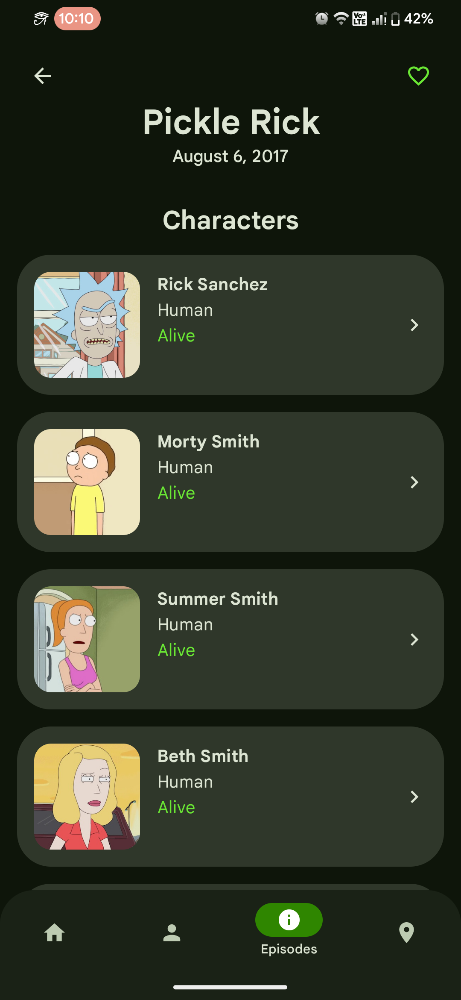
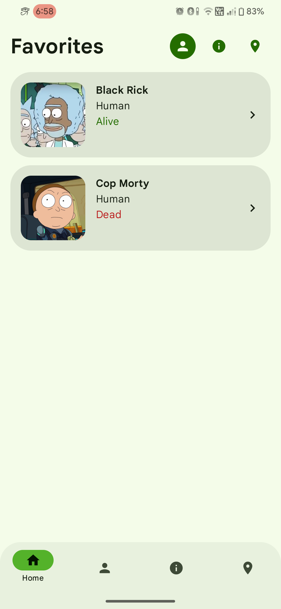
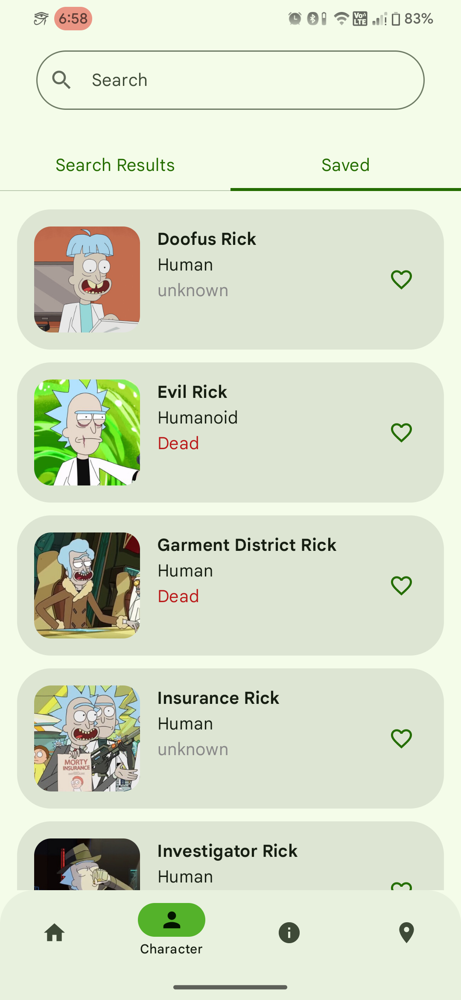

# Plumbus

### A Compose Multiplatform App to browse info on characters, locations and episodes from the Rick and Morty universe 

> ### Platforms
> 
> 
> 
> 

> ### Made With
> 
> 

## Screenshots 📱

|  |  |  |  |
|:-------------------------------------------------------------------:|:-------------------------------------------------------------------:|:-------------------------------------------------------------------:|:-------------------------------------------------------------------:|
|  |  |  |  |

## Try Out 🔧

> ### Android 
> Download and Install [Latest Release](https://github.com/shub39/Plumbus/releases)

> ### Desktop
> You can check out the dektop version by importing this project on Android Studio and and running `./gradlew run` in the terminal 

## Tech Stack 🛠️

- Compose Multiplatform for Shared UI and App logic 🧑‍💻
- Koin for dependency Injection 💉
- Ktor for making Http requests 🌐
- MVI + Clean architecture
- Kotlinx Serialization for Json parsing 📄
- [LandScapist](https://github.com/skydoves/landscapist) for Images 🌆
- Room for Local Databse 📊
- Kotlin Coroutines 🌴

## What's Planned? 🗓️
- [ ] Add a way to view browsing history. Like how deep you are in the rabbit hole
- [ ] Add a way to allow users to contribute information to the api. This could help the database to stay up to date as it is two seasons behind :(
- [ ] Add settings and Info pages

## Thanks 🙏

- Rick and Morty [API](https://rickandmortyapi.com/)
- [JetBrains](https://www.jetbrains.com/compose-multiplatform/) for such an amazing framework and IDEs